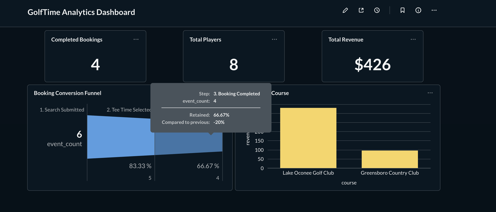
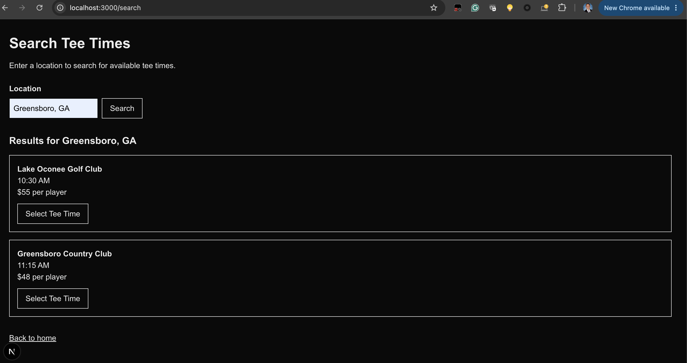

# GolfTime Analytics Implementation

GolfTime is a full-stack analytics implementation project demonstrating how user behavior can be instrumented, collected, stored, analyzed, and visualized across a booking journey.

The project was built as a portfolio demonstration of digital analytics implementation and implementation engineering skills.

## What It Demonstrates

- Frontend event instrumentation
- JavaScript/TypeScript analytics tracking
- Session-based event tracking
- REST-style analytics event collection
- Server-side event validation
- Cloud PostgreSQL event storage with Neon
- JSONB event properties
- SQL analysis
- Conversion funnel measurement
- Revenue and booking analysis
- Metabase dashboard reporting
- API testing with Postman
- Git-based development workflow
- Production deployment with Vercel

## Architecture

```text
User Interaction
      ↓
Next.js Frontend
      ↓
Analytics Tracking
      ↓
POST /api/events
      ↓
Next.js API
      ↓
Neon PostgreSQL
      ↓
SQL Analysis
      ↓
Metabase Dashboard
```

The application is deployed publicly through Vercel. Production analytics events are sent through the Next.js API and persisted in a Neon-hosted PostgreSQL database.

## Tracked Booking Journey

GolfTime instruments the following events:

1. `SEARCH_SUBMITTED`
2. `TEE_TIME_SELECTED`
3. `BOOKING_STARTED`
4. `BOOKING_COMPLETED`

Events contain a timestamp, session identifier, and event-specific properties.

This allows individual interactions to be associated with a broader user journey and enables session-based funnel analysis.

## Example Analytics Event

```json
{
  "event": "BOOKING_COMPLETED",
  "timestamp": "2026-09-20T12:59:00.000Z",
  "sessionId": "example-session-id",
  "properties": {
    "course": "Greensboro Country Club",
    "time": "11:15 AM",
    "price": 48,
    "players": 2,
    "totalPrice": 96
  }
}
```

## Analytics Dashboard



PostgreSQL event data is connected to Metabase for analysis and reporting.

Current analysis includes:

- Completed bookings
- Total players
- Total booking revenue
- Booking conversion funnel
- Revenue by course
- Recent analytics events
- Unique-session conversion analysis

### GolfTime Search Experience

The user-facing search and booking flow generates the analytics events used throughout the implementation.



## Technology Stack

**Application**

- Next.js
- React
- TypeScript
- Vercel

**Analytics & Data**

- JavaScript/TypeScript event tracking
- Neon PostgreSQL
- SQL
- JSONB
- Metabase

**Implementation & Testing**

- Postman
- Docker
- Git

## Repository Structure

```text
app/
  api/events/       Analytics collection API
  booking/          Booking flow
  search/           Tee-time search flow

lib/
  analytics.ts      Client analytics implementation
  db.ts             PostgreSQL connection

sql/
  schema.sql        Analytics database schema

docs/
  analytics-implementation.md
  event-tracking-plan.md
```

## Documentation

Detailed implementation documentation is available in:

- `docs/analytics-implementation.md`
- `docs/event-tracking-plan.md`

These documents describe the event specification, architecture, implementation decisions, validation process, and reporting design.

## Project Status

The core analytics pipeline is operational in production:

**Browser → Vercel → Next.js API → Neon PostgreSQL → SQL → Metabase**

User interactions on the deployed Vercel application generate analytics events that are persisted in Neon PostgreSQL and can be analyzed through SQL and Metabase reporting.

The production implementation has been validated end-to-end by completing the booking journey on the deployed application and confirming the resulting `SEARCH_SUBMITTED`, `TEE_TIME_SELECTED`, `BOOKING_STARTED`, and `BOOKING_COMPLETED` events in the production database.